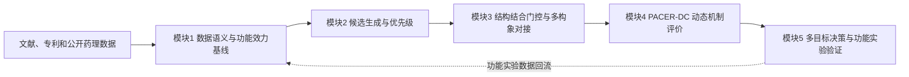

候选提出—结构门控—动态机制评价—功能验证设计
这一研究框架

区分四类分子：

1. 功能性PAM：依赖ACh增强信号。
2. ago-PAM或别构激动剂：无ACh时也能明显激活受体。
3. 能结合但没有PAM功能的别构配体。
4. 不能形成合理结合的分子。

传统docking主要处理第4类与前三类的区别，却很难进一步区分前三类。整个项目的科学起点。

# 候选提出—结构门控—动态机制评价—功能验证设计

本框架区分四类分子：

1. 功能性PAM：依赖ACh增强信号。  
2. ago-PAM或别构激动剂：无ACh时也能明显激活受体。  
3. 能结合但没有PAM功能的别构配体。  
4. 不能形成合理结合的分子。  

传统docking主要处理第4类与前三类的区别，却很难进一步区分前三类。这是整个项目的科学起点。

真正的主算法是PACER-DC。其他模块承担数据整理、baseline、候选产生和门控作用，不应全部包装成并列创新算法。

## 五模块流程

---

# 模块1：数据语义与功能效力基线

本模块承担数据清洗、药理语义标准化、二维功能效力模型、候选优先级与适用域，以及实验条件感知的功能建模。

## 1.1 药理数据整理与语义统一

### 输入

- M4 PAM文献和专利中的分子结构。
- EC50、Emax、pKB、logα、logτB、logαβ等药理数据。
- 不同物种、细胞、读出方式、ACh浓度和实验条件。
- PAM、ago-PAM、激动剂、拮抗剂和实验非活性分子。

### 处理

- SMILES标准化、去盐、去重。
- 化学系列和Murcko骨架划分。
- 区分实验终点，不把不同药理量简单合并。
- 记录来源、物种、读出平台、probe和实验条件。
- 按完整分子、化学系列或文献来源划分训练集和测试集，避免类似物泄漏。

### 输出

- 统一的分子—实验—药理终点长表。
- 化学系列标签。
- 活性、效力、内在激动和协同性标签。
- 可用于leave-series-out和外部验证的数据集。

### 当前状态

已经完成多批公开数据和专利数据整理，但不同文献之间存在明显实验条件偏移。例如，同一分子在不同研究中的协同性和内在激动参数可出现较大差别。

这个模块给出的重要结论是：M4 PAM不能只用一个混合pEC50标签描述。

## 1.2 二维效力基线与PACER-FS

### 目标

预测已知化学系列内部的相对效力，而不是假设所有系列共享同一个绝对pEC50尺度。

### 输入

- 标准化分子结构。
- ECFP等二维分子表示。
- 化学系列或来源分组。
- 实验pEC50。

### 算法

基础模型包括：

- similarity-kNN
- Ridge
- Random Forest
- ExtraTrees
- LightGBM
- ChemBERTa等表征基线

PACER-FS的核心处理是：

\[
y_{ij}=\mu_j+\Delta y_{ij}
\]

其中：

- \(\mu_j\)：第 \(j\) 个实验来源或化学系列的效力基线；
- \(\Delta y_{ij}\)：分子在该系列内部的相对SAR。

模型主要学习系列内相对效力。进入新系列时，需要少量真实功能实验锚点恢复绝对尺度。

### 输出

- 系列内相对效力预测。
- 预测不确定性和适用域。
- 新系列的锚点需求。
- 拒绝预测标记。

### 已有结果

严格系列留出下：

- Absolute QSAR macro Spearman：0.199
- PACER-FS macro Spearman：0.263
- 增益：+0.064
- 系列bootstrap 95% CI：[+0.017，+0.113]
- 11个系列中10个为正相关

这是一个真实、可复现的改进，但绝对性能仍然不高。它说明“系列偏移分解”有价值，不说明已经达到外部SOTA。

### 边界

PACER-FS适合：

- 已有少量同系列功能实验；
- 进行系列内部SAR排序。

它不适合：

- 完全未知chemotype的零样本PAM确认；
- 用二维结构判断PAM机制；
- 替代ACh依赖的功能实验。

## 1.3 实验条件感知的功能建模

### 输入

- 分子结构。
- assay类型、物种、读出方式、probe及实验条件。
- 多终点药理标签。

### 算法

已经测试：

- endpoint-only模型；
- pooled模型；
- 分子与实验条件联合核模型；
- PACER-AssayConditional；
- 多任务和多域模型。

### 输出

- 指定实验条件下的活性或效力预测。
- 跨实验条件的不确定性。
- endpoint/domain shift诊断。

### 当前结果

PACER-ContextKRR的macro有序一致性为0.714，高于endpoint-only的0.706，但低于pooled baseline的0.740，因此没有通过晋级标准。

独立Suven外测中，零样本主模型的Spearman置信区间跨零，50 nM分类AUC约0.569。

### 结论

实验条件确实重要，但当前数据量不足以证明复杂条件模型稳定优于简单共享模型。这个方向目前属于科学发现和模型设计依据，不是成功算法。

---

# 模块2：候选生成与优先级

本模块负责从已知M4 PAM结构、SAR和药效团约束出发，生成并过滤进入结构筛选的候选集合。

## 输入

- 已知M4 PAM结构。
- 已知SAR和药效团约束。
- 可合成片段或分子库。
- 理化性质、结构警示和适用域要求。

## 算法

已经尝试：

- 已知PAM邻域枚举；
- 片段重组与类似物扩展；
- masked diffusion生成；
- 结构和药效模型联合过滤；
- scaffold多样性选择。

## 输出

- 去重后的候选SMILES。
- 生成来源和母体chemotype。
- 理化性质、结构警示、与训练集相似度。
- 进入结构筛选的候选集合。

## 当前结果

- 最终保留24个计算候选。
- 覆盖20个Murcko骨架。
- 提供完整24分子集合和较保守的12分子集合。
- 代表性候选包括PACER0076、PACER0057、PACER0024和PACER0026。

## 重要边界

CPU masked diffusion没有稳定学会可靠化学语法，没有进入最终候选主线。当前候选主要是规则、已知化学空间扩展和多重过滤得到的，不应宣传为“扩散模型发现”。

这24个分子是计算优先候选，不是已发现的PAM。

---

# 模块3：结构结合门控与多构象对接

本模块负责判断候选是否能够合理占据M4别构口袋，并在多个受体构象下评估结合兼容性。它解决的是“能否合理结合”，不解决“能否增强ACh”。

## 3.1 静态结构结合门控

### 目标

排除明显无法合理占据M4别构口袋的分子。

### 输入

- M4实验结构，如7TRQ、7TRP、7TRS等。
- 候选分子的三维构象和质子化状态。
- 别构口袋坐标。
- 已知PAM共晶构象。

### 算法

- 配体和受体准备。
- 共晶配体重对接。
- Vina及其他结构评分。
- 相互作用指纹。
- 关键残基几何检查。
- 口袋覆盖、位姿漂移和构象一致性。

### 输出

- docking pose。
- Vina/结构评分。
- 相互作用指纹。
- 关键残基几何。
- 是否通过结构结合门控。

### 当前发现

结构特征可以判断候选是否有合理的口袋结合模式，但不能稳定预测PAM效力。

24个候选在7TRQ重对接中全部成功，但没有一个候选同时超过已知PAM的全部关键几何中位数。例如：

- PACER0076满足Y89和D432相关几何，但Q184不足；
- PACER0039满足Y89和Q184，但D432不足。

这更适合作为不同结构机制假设，而不是“结构总分最高就是最佳PAM”。

## 3.2 ensemble docking与PACER-XR

### 输入

- 静态实验结构或GaMD聚类得到的多个受体构象。
- 候选分子或公开active/decoy benchmark。
- 多种官方对接评分。

### 算法

- 每个分子对多个受体构象进行对接。
- 计算：
  - 单结构分数；
  - 最优构象分数BEmin；
  - 平均构象分数BEavg；
  - rank consensus。
- PACER-XR将多种公开评分进行排名融合。
- PACER-XR Cascade对极少数顶部候选使用更昂贵的评分。

### 输出

- 多构象结合兼容性。
- 构象敏感性。
- active/decoy富集指标。
- 结构筛选后的候选集合。

### 已有结果

在作者公开的广义M4别构调节剂benchmark上：

- PACER-XR ROC-AUC：0.7710
- PACER-XR Cascade ROC-AUC：0.7775
- PR-AUC：0.1067
- EF0.5%：20.40
- EF1%：13.73

但这是广义allosteric-modulator active/decoy检索，不是功能性PAM效力预测。

在更严格的功能真值测试中：

- holo-GaMD BEmin AUC约0.499；
- BEavg约0.457；
- 接近或低于随机。

### 结论

PACER-XR在公开结构检索任务上有竞争力，但不能称为功能PAM预测SOTA。ensemble docking解决的是“多个受体构象下能否合理结合”，没有解决“能否增强ACh”。

---

# 模块4：PACER-DC动态机制评价

PACER-DC是当前项目的核心方法。本模块包含动态结构分析与轨迹表征探索、PACER-DC主算法，以及药理对比学习与triplet。

## 4.1 动态结构分析与轨迹表征探索

### 输入

- 已公开的M4 MD/GaMD轨迹。
- ACh-only、ACh+PAM等体系。
- 蛋白内部距离、配体RMSD、接触占有率等轨迹特征。

### 算法

已经测试：

- 手工动态指标；
- PCA/tICA；
- replica-invariant triplet；
- anchor-guided triplet；
- 聚类和soft prototype；
- state-response fingerprint；
- 基于已知PAM方向的静态/动态投影。

### 输出

- 受体动态状态表示。
- 不同replica的一致性。
- ACh稳定性和耦合方向。
- 聚类稳定性、状态持续性和外部轨迹投影。

### 真实发现

1. LY2119620在3条独立1 μs轨迹中使正构配体RMSD平均降低约0.651 Å。
2. MK-97的蛋白耦合坐标与ACh稳定性在6/6条轨迹中同向。
3. 普通无标签triplet没有自动学习到稳定PAM功能状态。
4. Anchor-guided triplet提高了锚方向解释率，但聚类稳定性仍不够，未通过冻结门槛。
5. 单一PAM耦合轴也会把compound-110别构激动剂判为高分。

### 结论

动态轨迹中确实存在与正构配体稳定相关的信号，但“更像已知PAM轨迹”仍不等于“功能上是纯PAM”。必须加入无ACh对照排除内在激动。

## 4.2 PACER-DC主算法

### 输入

同一个候选必须具有四种匹配体系：

1. `candidate_probe`：M4 + 候选物 + ACh
2. `candidate_no_probe`：M4 + 候选物
3. `probe_only`：M4 + ACh
4. `apo`：M4

每种条件至少3条独立replica。统计独立单位是replica，不是轨迹帧。

### 第一层：可解释动态特征

从每条轨迹提取：

- ACh RMSD和原生接触占有率；
- 别构配体口袋接触和漂移；
- 受体内部距离；
- 关键残基网络；
- 口袋水网络等后续可扩展特征；
- binding compatibility。

### 第二层：轨迹编码

按baseline顺序比较：

1. 手工动态指标；
2. PCA/tICA；
3. VAMP或SPIB；
4. 满足数据条件后再做triplet微调。

VAMP、SPIB和triplet不是PACER-DC本身，它们是可替换的轨迹编码器。

### 第三层：双差分

\[
\Delta_\mathrm{PAM}
=E(\mathrm{candidate+ACh})-E(\mathrm{ACh-only})
\]

用于描述候选物在ACh存在时引起的额外协同变化。

\[
\Delta_\mathrm{AGO}
=E(\mathrm{candidate-no-ACh})-E(\mathrm{apo})
\]

用于描述候选物在无ACh时引起的激活样变化。

### 输出

PACER-DC不输出未经校准的单一“PAM概率”，而输出：

- `CoupledShift`：ACh存在时的协同耦合变化；
- `OrthostericStabilization`：ACh构象和接触稳定化；
- `IntrinsicActivationRisk`：无ACh时的激活样风险；
- `BindingCompatibility`：别构口袋结合相容性；
- `Uncertainty/AD`：replica不确定性、化学适用域和证据缺失；
- Pareto候选，而不是任意加权总排名。

### 当前实现程度

已经完成：

- 计分接口；
- 输入证据格式；
- bootstrap置信区间；
- replica级统计；
- 缺少上下文时拒绝评分；
- 静态结构不得冒充动态证据；
- Pareto比较；
- 自动审计；
- 42-run v2试验清单。

42个体系包含：

- 2个PAM阳性对照：LY2119620、CM00717；
- 1个别构激动剂：compound-110；
- 1个实验非活性困难负样本：CM00734；
- 2个计算候选：PACER0076、PACER0057；
- 共享ACh-only和apo对照；
- 各3条replica。

### 尚未完成

截至当前审计：

- 42个生产轨迹全部尚未启动；
- 完整四上下文候选数为0；
- 可重复小分子参数化环境尚未完全通过；
- 只有2种PAM正对照，未达到3种独立PAM chemotype；
- 没有确认“能够结合但没有PAM功能”的中性别构配体；
- 因此PACER-DC还没有实际性能结果。

也就是说：PACER-DC目前是一个严谨、可执行、带拒绝规则的方法原型，不是已经验证成功的预测模型。

## 4.3 药理对比学习与triplet

### 设想

希望微调已有轨迹embedding，使：

- 不同PAM、不同replica，但相同功能耦合状态的轨迹接近；
- PAM和无功能结合物分离；
- PAM和别构激动剂分离；
- 几何相似但功能不同的分子成为hard negative。

### Triplet构造

- Anchor：某个PAM轨迹状态；
- Positive：不同replica或不同chemotype中具有相同功能状态的轨迹；
- Negative：
  - 别构激动剂；
  - 实验非活性近邻；
  - 最理想的是“确认结合但无PAM功能”的配体。

### 输出

- 药理条件化的轨迹embedding；
- 功能状态距离；
- PAM、激动剂和无功能配体的判别。

### 当前状态

没有达到训练数据闸门，因此不能正式训练。

轨迹帧很多不等于独立分子很多。一个分子的十万帧，本质上仍然主要是一个药理标签，不能把帧数当成十万个阳性样本。

---

# 模块5：多目标决策与功能实验验证

本模块负责将前面模块的证据整合为计算优先候选，并设计功能实验验证路径。它不采用“所有分数加权求和”，而采用硬门控、适用域拒绝、多目标Pareto和实验优先级设计。

## 5.1 候选综合决策

### 输入

- PACER-FS相对效力和适用域；
- 结构结合门控；
- ensemble docking构象稳健性；
- PACER-DC动态证据；
- intrinsic agonism风险；
- M2反筛和理化性质；
- scaffold多样性；
- 不确定性。

### 算法

不采用“所有分数加权求和”，而采用：

1. 硬性门控；
2. 适用域拒绝；
3. 多目标Pareto筛选；
4. scaffold多样性约束；
5. 功能实验优先级设计。

### 输出

- 计算优先候选；
- 每个候选的证据向量；
- 不确定性和失败原因；
- 建议送测顺序；
- 机制对照组，而非仅一张总排名表。

### 当前状态

当前24个候选中，有15个进入已有动态结构证据的Pareto集合。但由于还没有候选特异的四上下文MD和功能实验，这15个只能称为结构稳健假设。

## 5.2 功能实验验证

功能实验验证承接多目标候选决策的输出，用于验证计算优先候选、机制对照组和建议送测顺序。

当前尚未展开具体实验方案。已有输出主要是：

- 计算优先候选；
- 每个候选的证据向量；
- 不确定性和失败原因；
- 建议送测顺序；
- 机制对照组。

而不是仅一张总排名表。

---

# 五模块主线与当前状态

整个流程可归为五个一级模块：

1. 数据语义与功能效力基线；
2. 候选生成与优先级；
3. 结构结合门控与多构象对接；
4. PACER-DC动态机制评价；
5. 多目标决策与功能实验验证。

其中，PACER-DC是核心方法。其他模块承担数据整理、baseline、候选产生和门控作用。

当前关键状态是：

- 24个分子是计算优先候选，不是已发现的PAM；
- 15个候选进入已有动态结构证据的Pareto集合，但只能称为结构稳健假设；
- PACER-DC已经完成计分接口、输入证据格式、bootstrap置信区间、replica级统计、拒绝评分、Pareto比较、自动审计和42-run v2试验清单；
- 42个生产轨迹尚未启动；
- 完整四上下文候选数为0；
- 可重复小分子参数化环境尚未完全通过；
- 只有2种PAM正对照，未达到3种独立PAM chemotype；
- 没有确认“能够结合但没有PAM功能”的中性别构配体；
- 因此PACER-DC还没有实际性能结果，目前是严谨、可执行、带拒绝规则的方法原型，不是已经验证成功的预测模型。