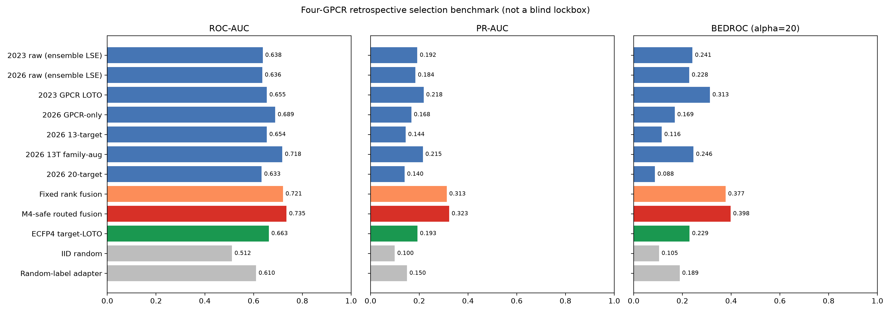
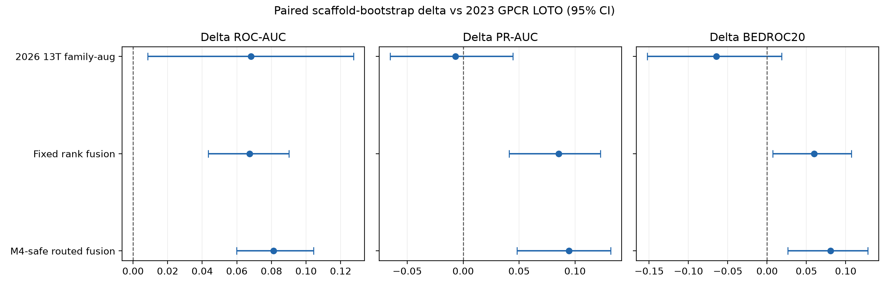
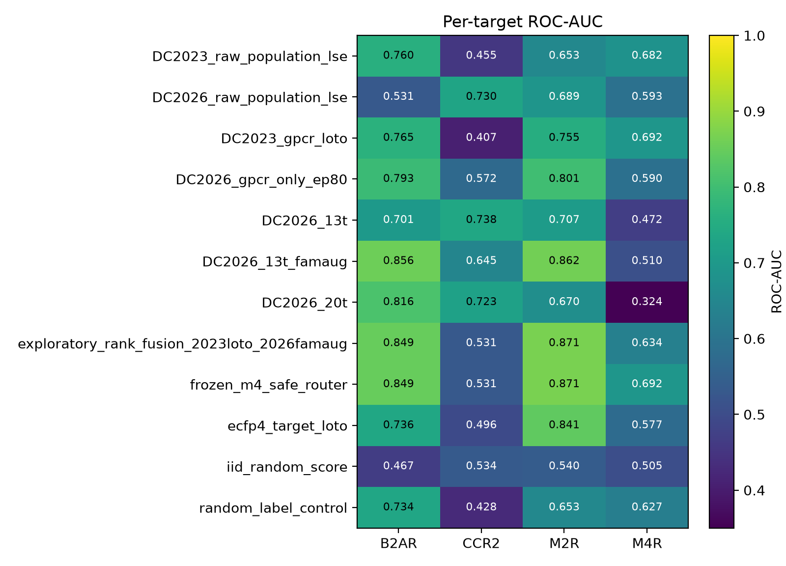

# DrugCLIP 代际与微调模型统一跑分结果 v01

## 结论先行

在 4 个 GPCR、28,618 个靶点—分子对、完全相同的分子与 40 个口袋构象上，**不存在“2026 checkpoint 全面优于 2023 checkpoint”**。两代模型呈现互补：2023 GPCR 迁移模型的头部富集更强，2026 13-target family-aug 的整体排序更强。

将两者做固定 1:1 靶点内秩融合，并沿用此前已经确定的“M4 保留 2023 权重”规则后，得到当前最好的开发集结果：

| 方法 | ROC-AUC | PR-AUC | BEDROC20 | EF1% | EF5% |
|---|---:|---:|---:|---:|---:|
| 2023 raw ensemble-LSE | 0.638 | 0.192 | 0.241 | 4.236 | 2.379 |
| 2026 raw ensemble-LSE | 0.636 | 0.184 | 0.228 | 2.454 | 2.418 |
| 2023 GPCR LOTO | 0.655 | 0.218 | 0.313 | **4.476** | 3.568 |
| 2026 13T family-aug | 0.718 | 0.215 | 0.246 | 1.733 | 2.420 |
| 固定 1:1 秩融合 | 0.721 | 0.313 | 0.377 | 3.645 | 4.281 |
| **M4-safe 路由融合** | **0.735** | **0.323** | **0.398** | 3.786 | **4.474** |
| ECFP4 target-LOTO | 0.663 | 0.193 | 0.229 | 1.693 | 2.324 |
| IID 随机 | 0.512 | 0.100 | 0.105 | 0.866 | 0.953 |

## 与主要基线的配对统计

以 2023 GPCR LOTO 为主要基线，按靶点分层、按 Murcko scaffold 进行 200 次配对 bootstrap。M4-safe 路由融合的增量 95% CI 为：

| 指标 | 中位增量 | 95% CI | 判定 |
|---|---:|---:|---|
| ROC-AUC | +0.081 | [+0.060, +0.104] | 稳定提高 |
| PR-AUC | +0.095 | [+0.048, +0.132] | 稳定提高 |
| BEDROC20 | +0.081 | [+0.026, +0.128] | 稳定提高 |
| EF5% | +0.963 | [+0.046, +1.876] | 稳定提高 |
| EF1% | +0.512 | [−2.823, +3.497] | 不确定，不能宣称提高 |

因此，当前可支持的结论是：**路由融合改善了整体排序、中前段富集和 5% 富集，但尚未证明最前 1% 富集优于 2023 GPCR 模型。**

## 与 docking 的同子集比较

在 28,527 个同时具有 Ensemble Glide BEmin 结果的配对样本上：

| 方法 | ROC-AUC | PR-AUC | BEDROC20 | EF1% | EF5% |
|---|---:|---:|---:|---:|---:|
| Ensemble Glide BEmin | 0.675 | 0.300 | 0.375 | **6.195** | 4.031 |
| 固定秩融合 | 0.721 | 0.313 | 0.378 | 3.634 | 4.276 |
| M4-safe 路由融合 | **0.735** | **0.323** | **0.398** | 3.775 | **4.469** |

路由融合在点估计上优于 Glide 的 ROC、PR、BEDROC20 和 EF5%，但 Glide 的 EF1% 更高。该 docking 比较尚未做独立配对置信区间，不能把点估计差异写成显著性结论。

## 这说明了什么

1. **checkpoint 年份不能决定部署。** 2026 raw 没有稳定超过 2023 raw。
2. **单看 ROC 会选错模型。** 2026 family-aug 的 ROC 很高，但 BEDROC 和 EF1 明显弱于 2023 GPCR LOTO。
3. **互补性是真实可利用的。** 固定融合同时提高 PR 和 BEDROC，而不是只提高一个宽松指标。
4. **M4 负迁移需要显式规避。** family-aug 在 B2AR、M2R 上强，在 M4 上退化；保留旧 M4 模型后，总体性能进一步提升。
5. **最终筛选应是分层系统。** 路由融合负责高召回与中前段排序，2023 GPCR/Glide 负责最头部复核；四上下文 PACER-FKG 再区分“结合”与“功能性 PAM”。

## 创新点的准确表述

本阶段可提出的算法点不是“又训练了一个 DrugCLIP”，而是：

> 面向 GPCR 虚拟筛选的能力分解与保守路由：利用旧版 GPCR 专化模型的早期富集能力和新版 family-aware 模型的全局排序能力，通过冻结的靶点内秩融合与 M4 负迁移保护路由，形成兼顾跨靶点排序和 M4 专化性能的筛选器。

这是一项有实证支持的开发集创新假设，但只有在新锁箱上复现后，才能升级为外部泛化结论。

## 证据边界

- 本数据已经用于开发，属于 retrospective selection benchmark，不是盲测锁箱。
- 活性/decoy 数据可能含二维理化性质捷径。
- 本评测回答 binding-candidate retrieval，不回答 PAM 功能或效力。
- “SOTA”尚未成立；下一步必须冻结当前路由，在未触碰的新外部集合上一次性揭盲。

## 可审计产物

- 协议：`project/docs/DRUGCLIP_GENERATION_BAKEOFF_PROTOCOL_V01.md`
- 脚本：`project/scripts/run_drugclip_generation_bakeoff.py`
- 结果表与输入 SHA256：`project/docs/assets/drugclip_generation_bakeoff_v01/`
- 单元测试：`project/tests/test_drugclip_generation_bakeoff.py`

