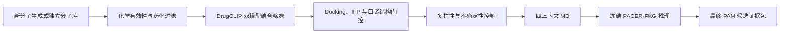

# PACER-M4 项目主线：算法开发与候选分子推理

日期：2026-10-02

## 一、项目要解决的问题

本项目面向毒蕈碱型乙酰胆碱 M4 受体（CHRM4）的正性别构调节剂（PAM）发现。

M4 PAM 结合受体的别构口袋，在乙酰胆碱（ACh）存在时增强受体响应。一个分子能够进入 M4 别构口袋，并不意味着它一定具有 PAM 功能。它可能只是能够结合但没有功能的别构配体，也可能在没有 ACh 时就推动受体激活，表现为别构激动剂或 ago-PAM。因此，本项目需要连续回答两个问题：

1. 候选分子能否以合理方式结合 M4 别构口袋；
2. 候选分子是否可能产生 ACh 依赖的正性别构调节，而不是仅仅结合或独立激活受体。

项目最终任务不是报告一个更低的 docking score，而是从新生成的分子中筛选出具有完整计算证据的 M4 PAM 候选，并给出可供后续实验验证的结构、药化性质、结合模式和动态功能依据。

## 二、算法开发与算法推理是两个阶段

PACER-M4 的工作应分为算法开发和候选推理两个阶段。两者使用的数据、评价方法和结论不同，不能混在一起。

### 1. 算法开发阶段

开发阶段使用已有实验标签、公开基准和已知配体，目的是建立并检验筛选方法。

这一阶段包括 DrugCLIP 结合筛选模型的微调和基准测试、静态结构门控方法的验证，以及四上下文动态功能方法 PACER-FKG 的开发与回顾性检验。已知 PAM、ago-PAM 和实验 inactive 分子在这一阶段充当训练、校准或验证对象，不是项目发现的新候选。

需要特别说明，MD 本身不是“训练算法”。MD 模拟产生受体在不同配体条件下的动态轨迹。PACER-FKG 从这些轨迹中提取四上下文动态差分，并使用已知分子检验这些差分能否反映功能类型。MD 是动态数据来源，编码器、差分表示、图特征和判别规则才构成算法。

### 2. 候选推理阶段

推理阶段在算法、参数、阈值和筛选规则冻结后开始。输入应是未参与模型开发的新分子，输出是按证据逐级缩小的候选集合。

正式推理必须从新分子生成或独立分子库开始，依次经过药化性质过滤、DrugCLIP 结合筛选、结构门控和四上下文动态复核。推理过程中不能因为某个候选结果不理想而重新调整模型，否则候选不再是独立应用结果。

因此，算法开发完成并不等于项目完成。只有把冻结算法应用到新分子，并得到最终候选及其完整证据包，才完成比赛要求下的虚拟筛选任务。

## 三、算法开发阶段已经完成的工作

### 1. DrugCLIP 结合筛选模块

DrugCLIP 模块回答“分子与目标口袋是否具有结合匹配性”。项目对 DrugCLIP 的分子端和口袋端投影进行参数高效微调，并采用整靶点留出、Murcko 骨架隔离和多随机种子评价，避免把同一靶点或相近骨架同时放入训练集和测试集。

当前冻结结果包括：

- 13 靶点 family-augmented 三种子集成的宏 ROC-AUC 为 0.6414，官方 DrugCLIP 为 0.5442，ECFP4 logistic 为 0.5681；
- 13 靶点相对官方模型的配对 bootstrap 置信区间为 `[+0.067,+0.102]`；
- 20 靶点全覆盖使用纯 ep80 配置，相对官方模型的置信区间为 `[+0.028,+0.062]`；
- 20 靶点不叠加 family augmentation，因为该配置没有额外收益；
- EF1% 尚未稳定超过强二维基线，因此该模块只能主张改善总体结合排序，不能主张所有早期富集指标达到通用 SOTA。

对于 M4 推理，当前路由规则不是只采用一个新模型。旧 DrugCLIP 权重在 M4 留出任务上更稳，因此作为 M4 主结合排序；family-augmented 模型作为第二意见。两种模型共同支持的分子优先进入后续结构和动态复核。DrugCLIP 只负责结合相容性，不能直接给出 PAM 功能或效力结论。

### 2. 静态结构与药化门控模块

静态结构模块使用 docking 产生候选结合姿势，并检查别构口袋覆盖、关键残基接触、相互作用指纹和姿势稳定性。药化模块检查分子有效性、重复结构、PAINS、反应性基团、分子量、脂溶性、极性表面积、氢键特征、QED、合成可行性、微状态和结构新颖性。

已有实验表明，Vina affinity 与 M4 PAM 功能效力的相关性很弱，多构象 docking 也不能直接恢复 PAM 功能排序。因此 docking 在本项目中的作用是排除明显不合理的姿势和结合模式，而不是作为最终功能评分。PACER-FS、IFP 和 ensemble docking 可以提供结构解释，但不能代替四上下文功能复核。

### 3. 四上下文动态功能模块

对于每个待复核分子，构建四个匹配体系：

- `A`：apo 受体；
- `P`：受体与 ACh；
- `C`：受体与候选分子；
- `CP`：受体、ACh 与候选分子。

在同一受体底座、膜环境、模拟协议和匹配 replica 下，计算：

```text
Delta_PAM = CP - P
Delta_AGO = C - A
Delta_INT = CP - P - C + A
```

`Delta_PAM` 描述加入候选后 ACh 条件体系的变化，`Delta_AGO` 描述候选单独引起的构象扰动，`Delta_INT` 描述候选与 ACh 共同存在时的非加性交互变化。当前主方法使用冻结的 C1-BS256 动态表示和 PACER-FKG，在预定义受体区域中比较不同 replica 的动态方向一致性。

该模块已经完成三类已知分子的回顾性检验：

- 已知 PAM LY2119620：主区域 R1/R3 direction cosine 为 `+0.634`；
- compound110：主区域为 `+0.584`；
- 实验 inactive hard negative CM00734：主区域为 `-0.327`，完整 9 个报告区域均为负。

CM00734 与 LY2119620 的动态变化幅度仍有明显重叠，说明有效信息来自跨 replica 的方向一致性，而不是变化幅度。Stage B 沿用冻结的 encoder、normalization、RFF、graph、region 和 contrast，没有根据 CM00734 的结果重新调参。

这一结果为 PACER-FKG 提供了初步功能特异性支持，但样本数仍然很小。它证明冻结方法值得进入候选推理，不等于已经建立具有可靠灵敏度、特异度和 AUC 的通用 PAM 分类器。

## 四、正式候选推理流程

正式推理应使用冻结算法，对新分子执行以下流程。



### 第一步：生成新分子

生成模块从已知 M4 PAM 化学空间和 M4 别构口袋约束出发，形成新的候选结构。可以并行使用 BRICS 片段重组、已知骨架类似物扩展、SMILES 生成模型和口袋条件生成模型。不同生成器产生的分子应统一标准化、去重，并记录生成方法、随机种子和母体结构。

生成阶段不要求所有分子远离已知 PAM。候选库应同时包含三类结构：已知化学型附近的局部优化分子、保持主要药效团但更换局部骨架的分子，以及化学距离较大的探索性分子。这样既能提高命中概率，也能保留发现新骨架的可能。

### 第二步：药化性质和成药性预筛

先执行成本较低的规则过滤，删除无效 SMILES、重复结构、严重反应性结构、明显 PAINS 和不合理理化性质分子。随后综合 QED、Lipinski/Veber 条件、SA score、logP、TPSA、可旋转键、芳香环比例、微状态稳定性和潜在毒性警示。

这些规则用于排除明显不适合继续计算的分子，不能把单一 QED 或 Lipinski 规则当作药物成功概率。

### 第三步：DrugCLIP 结合筛选

对通过药化过滤的分子计算 M4 别构口袋匹配分数。M4 主排序使用冻结的旧 DrugCLIP 路由，family-augmented 模型提供第二意见。模型结果应按固定规则组合，例如分别保留两个模型的高排名分子，并优先选择双模型共同支持者，同时保留少量模型分歧候选用于探索。

该步骤的输出是“具有 M4 口袋匹配证据的分子”，不是 PAM。

### 第四步：结构结合门控

对 DrugCLIP 筛出的分子进行 docking 和必要的受体多构象对接。评价内容包括姿势是否位于 M4 别构口袋、口袋覆盖、关键残基接触、IFP、姿势聚类、质子化状态敏感性和不同受体构象间的稳定性。

结构门控采用硬性淘汰与 Pareto 选择，不把 Vina affinity、DrugCLIP 分数和 QED 随意相加为总分。该步骤还应维持化学骨架多样性，避免最终名单全部来自同一系列。

### 第五步：四上下文动态复核

只对结构证据最完整、化学性质合理且具有多样性的少量候选运行四上下文 MD。每个候选沿用冻结的模拟协议、replica、特征提取和 PACER-FKG 数值状态。推理时只生成候选相关的 `C` 和 `CP` 体系，并复用经过兼容性审计的 `A` 和 `P` 对照。

候选应与 LY2119620、compound110 和 CM00734 的冻结参考模式比较，重点报告：

- `Delta_INT` 在预定义机制区域的跨 replica 方向一致性；
- `Delta_PAM` 和 `Delta_AGO` 的相对模式；
- ACh 稳定性、候选 pose retention 和关键残基接触；
- 与 PAM 正对照和 inactive hard negative 的相似与差异；
- 轨迹收敛、replica 分歧和模型不确定性。

PACER-FKG 输出应是多维证据和拒绝原因，而不是当前尚未校准的“PAM 概率”。

### 第六步：形成最终候选

最终结果应是少量高优先级预测 PAM 候选，而不是一个只有 docking score 的排名表。每个候选应包含：

- 二维结构、标准 SMILES、立体化学和建议微状态；
- 生成来源、与已知 M4 PAM 的相似度及骨架新颖性；
- 药化性质、成药性风险和可合成性判断；
- DrugCLIP 两模型排名及分歧；
- docking pose、IFP、口袋覆盖和结构解释；
- 四上下文动态结果及其与三类参考分子的比较；
- 结论等级、不确定性和建议实验顺序。

在没有湿实验的情况下，正确称呼是“高优先级预测 PAM 候选”或“待验证 PAM 假设”。只有在 M4+ACh 功能实验中观察到曲线左移、效应增强，并排除候选单独给药引起的明显激动后，才能称为获得了新的功能性 PAM。

## 五、当前项目所处的位置

目前算法开发阶段已经形成两项主要资产：

1. DrugCLIP 结合筛选模块已经完成严格基准、模型冻结和 M4 路由设计；
2. PACER-FKG 已在 PAM、compound110 和实验 inactive hard negative 上完成回顾性三类检验，获得初步功能特异性支持。

项目也已经积累了候选生成和筛选资产，包括历史生成的 200 个 PACER 候选、24 个早期结构候选，以及经旧 DrugCLIP 与 family-augmented 模型联调得到的 5 个双优分子：`PACER0040`、`PACER0154`、`PACER0125`、`PACER0057` 和 `PACER0053`。

但这些分子产生于模型持续开发期间，当前结果主要证明模块能够交接，并不等于完成了冻结全流程后的正式前瞻推理。尤其是这 5 个候选尚未全部完成冻结四上下文动态复核。因此，项目当前的准确状态是：

> 算法开发和回顾性验证已经基本闭环，最终候选推理尚未完成。

## 六、接下来最短的执行路线

1. 冻结 DrugCLIP 路由、药化过滤、结构门控、PACER-FKG 数值状态和候选晋级规则；
2. 冻结一个不参与后续调参的新分子批次，或把现有候选明确划分为推理集；
3. 完成去重、药化性质、PAINS、可合成性和骨架多样性筛选；
4. 使用 M4 主 DrugCLIP 与 family-augmented 第二意见完成结合排序；
5. 对晋级分子执行 docking、IFP 和多构象结构门控；
6. 预先确定进入四上下文 MD 的候选数量和选择规则；
7. 对最终候选运行冻结 PACER-FKG，不再改模型；
8. 输出 1 至 3 个高优先级候选及完整证据包，并提出 M4+ACh、候选单独给药和 M2 反筛实验方案。

## 七、项目最终成果应如何表述

PACER-M4 的方法学成果是一套把新分子生成、药化过滤、结合筛选、结构门控和 ACh 条件动态复核连接起来的 M4 PAM 虚拟筛选方法。DrugCLIP 提高结合候选的筛选效率，docking 与 IFP提供结合模式解释，四上下文 PACER-FKG进一步检查候选是否呈现与功能性 PAM 相符的动态方向，并识别仅能结合或缺乏稳定协同模式的分子。

项目的应用成果应是一组经过全流程推理的 M4 PAM 候选及其计算证据，而不是模型开发阶段的 AUC、已知 PAM 的回顾性结果或单一 docking 分数。模型基准用于证明方法具有使用价值；最终候选推理用于证明这套方法能够产生具体的药物发现结果。二者共同构成完整项目。
